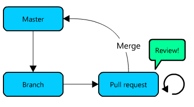
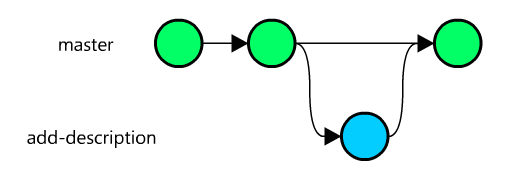
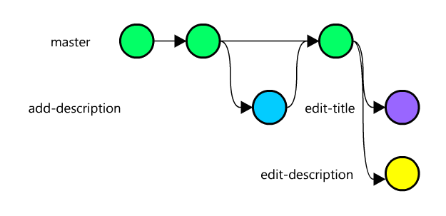
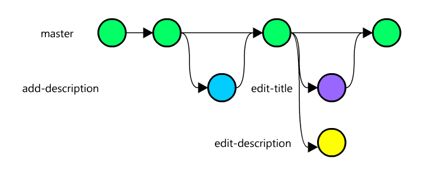
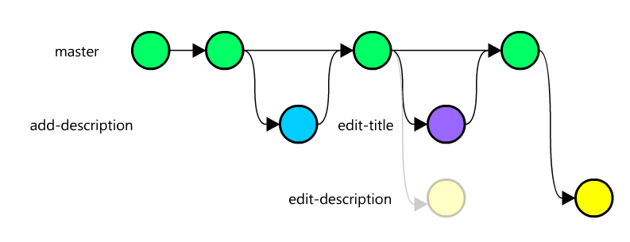
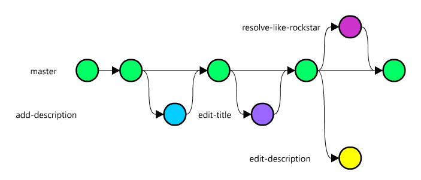
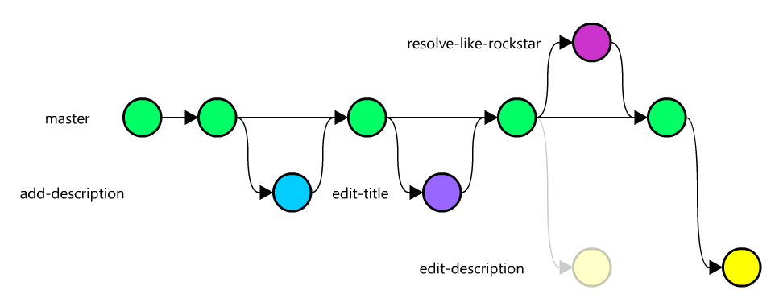

(This article has been posted in Sharetribe blog)

# Just enough Git for a non-developer

At Sharetribe almost everyone is somehow dealing with the code. That's the spirit of a small tech startup. We use Git and Github for source code management.

This article was meant to be an internal document for our non-developers who have to small code changes every now and then, namely our designer and analytics expert. However, as this stuff might interest others, I decided to make the article in a form of a blog post.

The best way to learn is by doing. That's why this tutorial contains also an interactive part. The tutorial can be found here https://github.com/sharetribe/just-enough-git. Feel free to make your own fork.

## Prerequisite

The article concentrates on branching. I expect that you already have the basic knowledge of Git, that is:

* You know how to access and use command-line
* You have git installed
* You have a Github account
* You know how to `git clone` a repository
* You know how to view current `git status`
* You know how to `git add` changes to next commit and how to `git commit` them
* You know how to `git push` the commits to Github
* You know how to `git pull` others' commits from Github
* You know what is a code branch, although you may not be familiar with them

That said, you already know quite a lot! However, to be efficient with Git, there are still a couple tricks you need to learn.

## The branching model

At Sharetribe, we use a simple and minimalistic branching model, which goes like this:

1. **Branch:** When you start working with a new feature/bug fix/document improvement/anything, you create a new branch.
1. **Pull Request:** As soon as possible, even before the feature is ready, push the branch to Github and create a Pull Request, so that others can see what you are up to.
1. **Rebase:** Make sure, that your branch is up to date. If not, rebase.
1. **Review:** When the feature is ready, ask a fellow teammate for a review. Fix the issues the reviewer found, if any
1. **Merge:** When the reviewer gives green light, merge the Pull Request to master.



A rule of thumb is that you should **never brake the master branch**. Master branch goes always to production.

## Learning goals

In order to follow that branching model, you need to learn a couple new Git skills:

* Your git is properly configured
* You know how to create a branch
* You know how to jump from branch to another
* You know how to push the branch to Github
* You know how to update (rebase) your branch to include newest changes by others
* You know how to resolve merge conflicts

## Git configurations

In order to work efficiently with the branching model, you need to have following git configurations set. Open command-line and type:

```
git config --global push.default current
git config --global branch.autosetuprebase always
```

Now you're ready to start.

# Let the tutorial begin

### 1. Fork

Go to the tutorial repository in Github, https://github.com/sharetribe/just-enough-git. Click **Fork** on the upper right corner. This creates a copy of the tutorial under your username.

Now, clone the repository to your local machine. On command-line, type:

```
git clone git@github.com:[your username here]/just-enough-git.git
cd just-enough-git
ls
```

You should now see the content of the repository. There are not that many files, but the one we are interested in is the `index.html` file. Open it in your browser to view the content.

### 2. Let's add description!

Now let's add a description to our website! Do you still remember the branching model? The first thing to do is **Branch**. So, let's create a new branch.

First, type:

```
git status
```

From the first line, you see that you are currently on `master` branch.

`git checkout` is a command to jumps from branch to another. If you give it an option -b, it will create a new branch. Let’s try this. Type:

```
git checkout -b add-description
git status
```

Congrats! You created a branch. `git status` shows you that you are currently in the newly created `add-description` branch.

Let's make a change to `index.html`. You can see that there's an empty paragraph with class `description`. Add a description, so that the result is:

```
<p class="paragraph">This is how you branch like a rockstar!</p>
```

Next, save the file and use `git add`, `git commit` and `git push` to save and push your changes.

```
git add index.html
git commit
git push
```

Now, go to the Github repository. You can see that Github is suggesting you to create a new Pull request.

Hit the **Compare and create a pull request**, add title and description to the Pull request and create it.

The repository currently looks like this:


Now, go to Github to your pull request and click **Merge pull request**. Now you branch got merged to master. The repository looks like this:



Your changes has now been merged to master, so you don't need your branch anymore. On the pull request page, click **Delete branch**.

Now back to command-line. Jump back to master branch.

```
git checkout master
```

If you now take a look at `index.html` you can see that your latest changes are not there yet. That's because locally your `add-description` branch and `master` are still separated. We only did the merge on Github. Thus, you need to pull the newest changes from Github.

```
git pull
```

Now you can see your changes in place.

Let's recap what we've learned so far:

* `git checkout -b [branchname]` creates a new branch
* `git checkout [branchname]` jumps to another branch
* In Github, you know how to create a pull request from your branch and how to merge it

From the five step branching model, you already master 3 steps: **Branch**, **Pull request** and **Merge**. Next we learn how to **Rebase**.

### Updating your branch

While you are working in your own branch, others might be pushing their changes to master branch. It's important to update your branch to include these changes. That way you avoid having a huge merge hell after working one week in isolation with your own branch.

Let's create two new branches, `edit-description` and `edit-title` from the master branch:

```
git checkout -b edit-description
```

Go and edit the `index.html` file, so that the description block looks like following:

```html
<p class="paragraph">This is how you rebase like a rockstar!</p>
```

When your ready, save the file and push the changes to Github.

```
git add index.html
git commit
git push
```

Go to Github and make a new pull request, but do not merge it this time.

Now back to the command-line. At the moment you are in `edit-description` branch. Jump back to master:

```bash
git checkout master
```

Now create the other branch:

```bash
git checkout -b edit-title
```

Edit the `index.html` so that the title is now:

```html
<h1>Welcome to interactive Git and Github tutorial</h1>
```

Again, save and push the changes to Github.

```
git add index.html
git commit
git push
```

Go to Github and make a new Pull request, but do not merge it.

Let's recap what we just did: We created two branches, `edit-description` and `edit-title`. We did Pull request for both of them. The repository currently looks like this:



Now go to Github and merge the `edit-title` pull request.

On command-line, go to master and pull the changes

```
git checkout master
git pull
```

Now the repository looks like this:



As you can see from the diagram, the `edit-description` branch is lagging behind. There are new changes in master that are not included in `edit-description` branch. It's time to rebase.

Rebasing means that we change the "base" of the branch. Let's try it in practice.

Go to the branch that you want to update:

```bash
git checkout edit-description
```

Rebase it on top of the master branch:

```bash
git rebase master
```

Now the repository looks like this:



The `edit-description` has now a new base. It has been placed on top of the latest changes on the master branch. Open the `index.html` file. You can see that the title includes now `and Github`, the change that was made in the `edit-title` branch.

Push the updated branch to Github. This time we have to force push the branch, because its history has changed:

```
git push --force
```

**WARNING!** The main purpose of Git is to make sure you never lose any changed you've made. It's damn difficult to screw up things with Git so badly, that someone would lose his day's work. However, `--force` is the only command in Git which allows you to make catastrophical screw ups. So, be careful. Make sure you are in a correct branch when you force push. **NEVER force push on master branch.** **NEVER FORCE PUSH ON MASTER BRANCH**.

**WARNING #2!** You ONLY need to force push after rebase. **Never force push, unless you have just rebased**.

Let's recap:

* We have now learned how to `git rebase` your branch to include latest changes from master
* We learned how to `git push --force` changes after rebase
* We learned that with great `--force` comes a great responsibility.

### Resolving conflicts

Git is pretty good at merging branches together. However, if two people edit the same part of the same file at the same time, Git doesn't know how to handle it. In this case, you have to manually resolve the conflict.

Let's try this out.

Remember that you have now an unmerged branch `edit-description`, which changed the description paragraph in `index.html`. Create yet another branch in which we edit the description paragraph too.

```bash
git checkout -b resolve-like-rockstar
```

Edit the `index.html` file, so that the description is following:

```html
<p class="paragraph">This is how you resolve conflicts like a rockstar!</p>
```

When your ready, push the changes to Github.

```
git add index.html
git commit
git push
```

Go to Github and make a new Pull request and merge it immediately.

Now go to master and pull changes.

```
git checkout master
git pull
```

Your repository looks now like this:



Yet again, we see that there's one branch, `edit-description`, that is lagging behing. Let's rebase it:

```bash
git checkout edit-description
git rebase master
```

Whou! That did not go smoothly. Git is saying that there's a conflict in `index.html` file:

```
CONFLICT (content): Merge conflict in index.html
```

You can also see this with status command, type:

```bash
git status
```

Which prints:

```

...

Unmerged paths:
  (use "git reset HEAD <file>..." to unstage)
  (use "git add <file>..." to mark resolution)

    both modified:   index.html

no changes added to commit (use "git add" and/or "git commit -a")
```

Open the `index.html` file in your editor and you will see this:

```html
<<<<<<< HEAD
<p class="description">This is how you resolve conflicts like a rockstar!</p>
=======
<p class="description">This is how you rebase like a rockstar!</p>
>>>>>>> [your commit message]
```

Edit the file so that it include both changes and remove lines starting with `<<<<<<<`, `=======` and `>>>>>>>` so that the end result is:

```html
<p class="paragraph">This is how you rebase and resolve conflicts like a rockstar!</p>
```

Save the file. Now that you've resolved the conflict, you have to mark the file as resolved. Do it with `git add`:

```bash
git add index.html
```

Do this for every file that has conflicts.

After you have resolved all the conflicts, `git status` should not show you any `Unmerged paths`:

```bash
git status
```

Now that we are done, we can continue:

```bash
git rebase --continue
```

Git moves to the next commit. You may have to resolve any additional conflicts.

If anything goes wrong during the rebase, you can always enter `git rebase --abort`. It will cancel the whole rebase process.

Now it's time to be extra careful again, and force push our changes.

```bash
git push --force
```

And that's it! You just resolved a merge conflict. `edit-description` is now ready to be merged to master. Your repository looks now like this:



### Final recap

You have now learned all the necessary steps: Branch, Pull request, Rebase, Review (just ask someone to take a look at your code) and Merge.

Here's a list of commands you need when working with branches:

* `git checkout [branchname]`: Jump from a branch to another
* `git checkout -b [branchname]`: Create a new branch
* `git rebase master`: Rebase your branch on top of master branch
* `git add [filename]`: Mark conflicted file as resolved
* `git rebase --continue`: Continue rebasing after resolving conflicts
* `git rebase --abort`: Abort rebasing

With these commands, you should be able to work with the development team and git!
